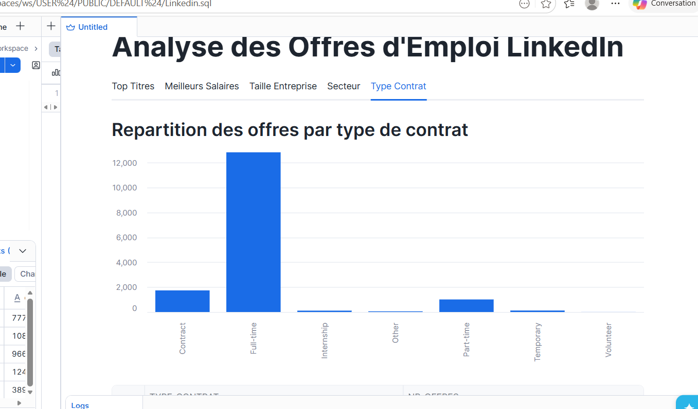
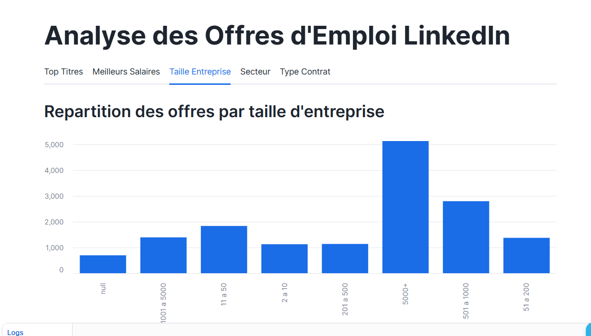
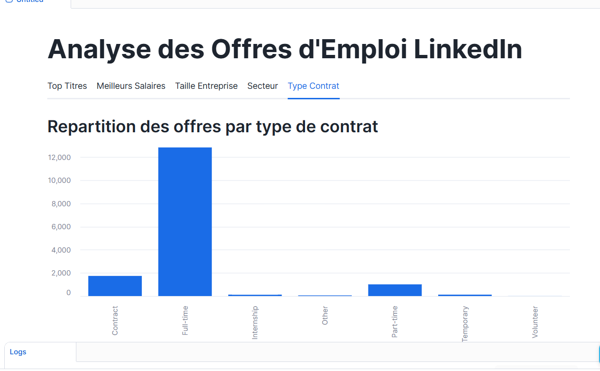
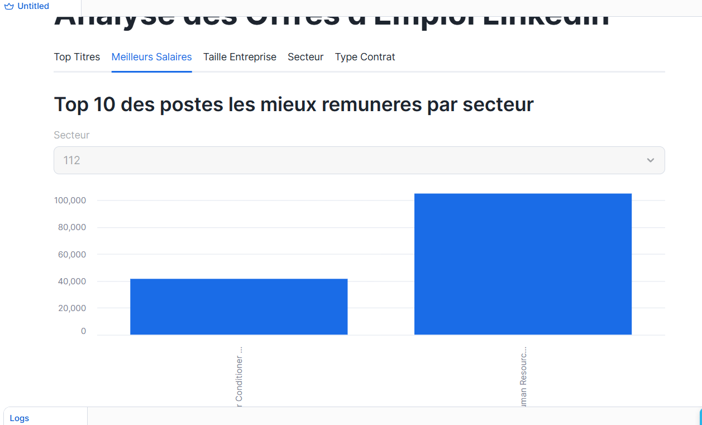

ESME_EVALUATION_ARCHITECTURE_BIGDATA_2026
Analyse des Offres d'Emploi LinkedIn avec Snowflake & Streamlit

Binôme : Chris BOUPASSIA & Sana ZOUAOUI
Formation : Architecture Big Data — ESME 2026

---

Ce qu'on a fait

On a chargé des données LinkedIn (offres d'emploi, entreprises, secteurs) depuis un bucket S3 dans Snowflake, puis on a créé une application Streamlit pour les visualiser.

---
Fichiers
- queries.sql : tout le SQL utilisé (création base, tables, chargement, analyses)
- app.py : le code Streamlit avec les 5 visualisations

---
Les 5 analyses

1. Top 10 des titres de postes les plus publiés par secteur
Ce graphique montre les 10 intitulés de poste les plus fréquents dans un secteur donné. On peut choisir le secteur dans un menu déroulant. Cela permet de voir quels métiers sont les plus demandés selon le domaine d'activité.

---
2. Top 10 des postes les mieux rémunérés par secteur
Ce graphique affiche les 10 postes avec le salaire médian le plus élevé dans un secteur. Les salaires ont été normalisés en équivalent annuel car certaines offres indiquaient un salaire horaire ou mensuel.

---
3. Répartition des offres par taille d'entreprise
Ce graphique montre combien d'offres d'emploi ont été publiées selon la taille de l'entreprise (de 1 employé à plus de 5000). On voit clairement que les grandes entreprises publient beaucoup plus d'offres que les petites structures.

---
4. Répartition des offres par secteur d'activité
Ce graphique présente les 20 secteurs d'activité avec le plus grand nombre d'offres publiées. Il permet d'identifier les secteurs les plus actifs sur le marché de l'emploi LinkedIn.

---
5. Répartition des offres par type de contrat
Ce graphique montre la distribution des offres selon le type de contrat : temps plein, temps partiel, contrat, stage, etc. On observe que le temps plein représente la grande majorité des offres publiées.

---
Problèmes rencontrés

JSON — Le chargement JSON ne fonctionne pas avec un COPY INTO classique. On a dû passer par une table intermédiaire VARIANT puis insérer les données avec data:champ::STRING.

Salaires — Les salaires sont en horaire, mensuel ou annuel. On a tout normalisé en annuel avec un CASE sur pay_period.

CSV mal formés — Certaines lignes posaient problème. Réglé avec ON_ERROR = 'CONTINUE'.
